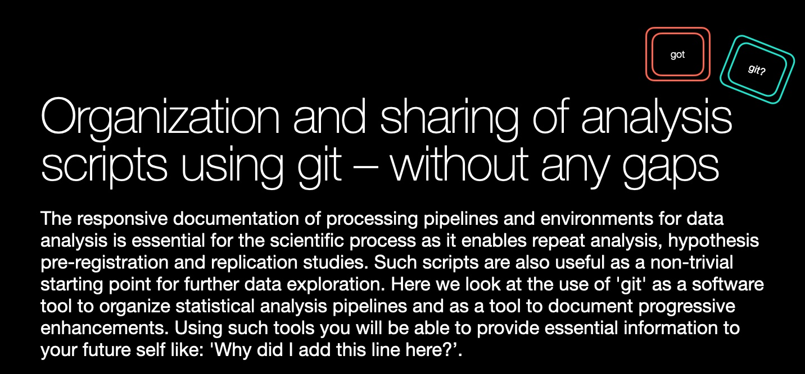
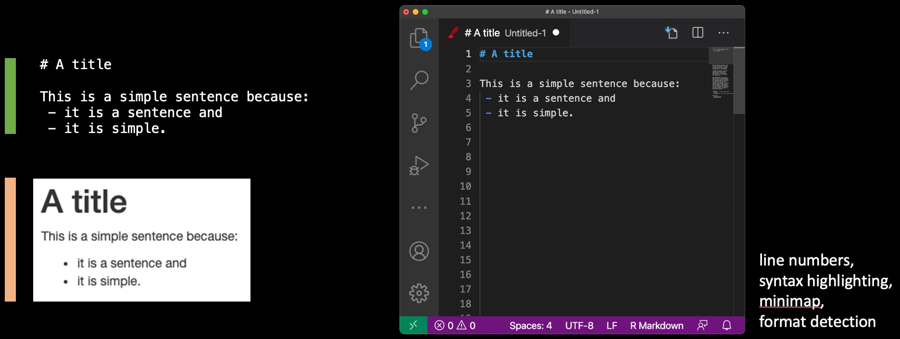
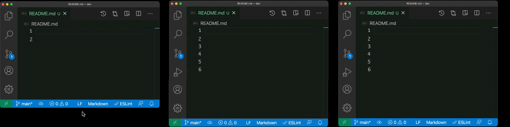
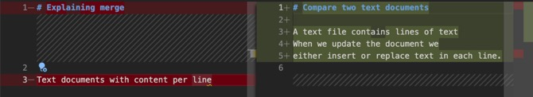
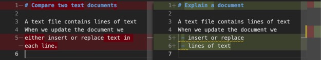
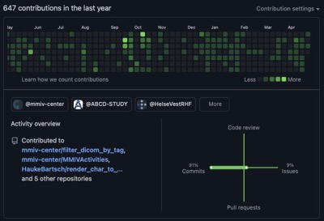

# social-coding

This course is part of a presentation series "Without Any Gaps" at the Mohn Medical Imaging and Visualization Center that provides introductory presentations covering research project management and technological tools to support open science. This presentation was given first as part of the Bergen Biostatistical Seminar (Bbiss) series in April 2021.

## Content creation

A modern text editor focuses on content over form and provides features that make it easy to handle text and text changes.

Text editors are specialized tools that are different from word processors. Many are free or open source. Images on this page are created using the text editor Visual Studio Code.

Text files may share content, or represent the same document changed over time. Each time we can identify lines that are the same or lines that are different.

Here a view of the difference between the first two files

Line numbers are followed by either "+" if a line has been added or by "-" if the line needs to be removed. If we follow these instructions we can convert the first document into the second document - basically here we replace all lines with new content. The tool did realize that the empty line 2 does not have to be changed and can become line 6 in the second document. The *diff* algorithm that computes such matches is an essential tool.

In the second diff 3 lines have changed. Listing the diffs between two version of a document is sometimes also called at *patch* as you can *patch* the problems in the first file by applying all the changes.

## Why should I use version control - and why git?

We need to document the changes in a project. Why some decision have been made and what changed relative to before. That is the major reason to use tools for version control. 

But there are other benefits:
 - social media profile relevant for future employers
 - ability to talk to your future self
 - test a new feature safely and remove all its traces - in case it was not a good idea
 - get a free backup, work from anywhere
 - workflow integration such as Wiki, issue/bug tracking, project home page, continuous integration and security alerts
 - free and open-source software and a large community

Yes, and also to work together with other people on larger projects.

## History of a document and how it maps to git

As today becomes history, what do we want to remember? Here an example where we store our work when:
 - we start
 - we have our first prototype
 - we remember to check for is.na()
 - we forgot to add the library so this will work for other people testing it
 - we document what we did.

&nbsp;

In this example "main" is the name of the branch in the repository that we do work in currently. Its position is linked to the location of the latest change - the *HEAD* of our repository. Adding a memory point, a *commit* will store the status of the file and provide a numeric code for that point, the *commit-id*.
