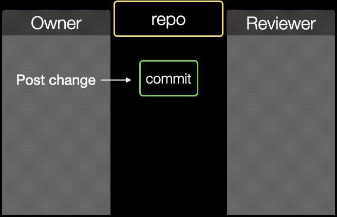
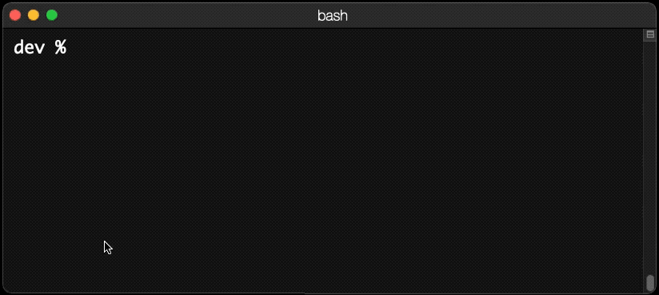
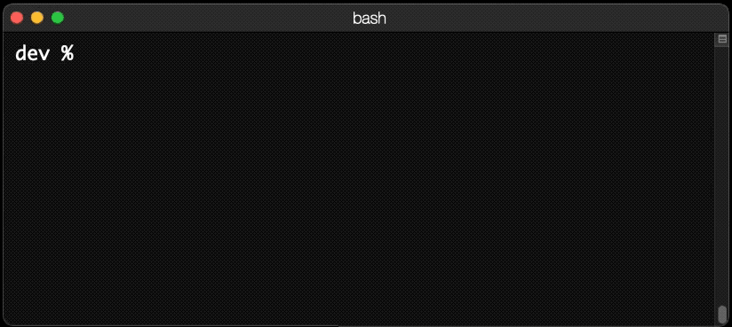
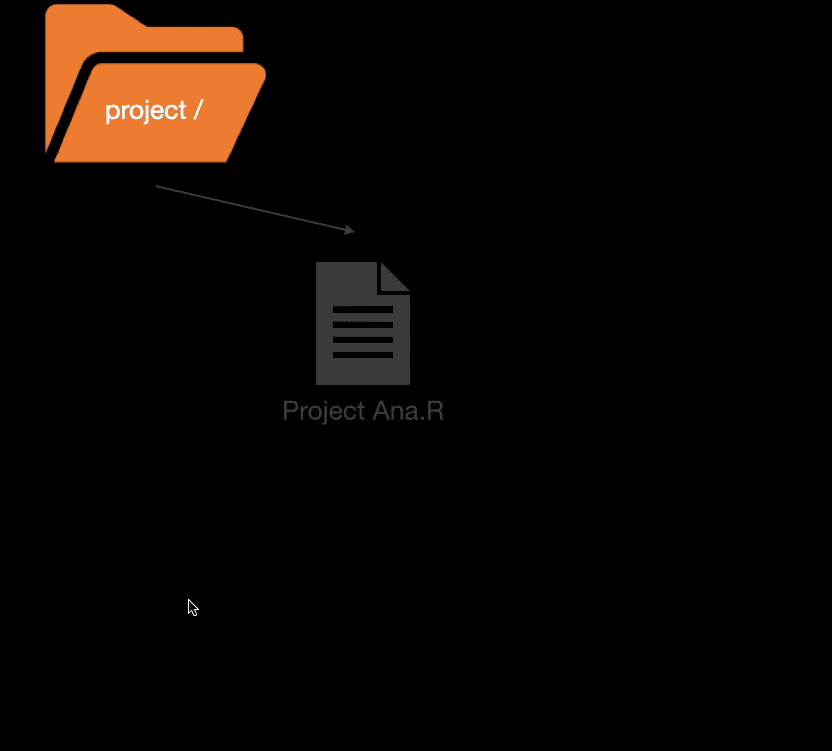
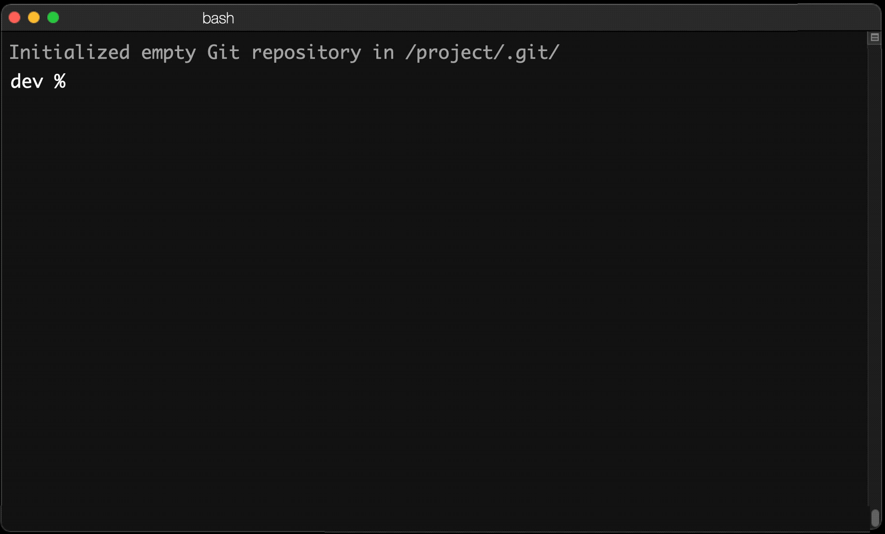
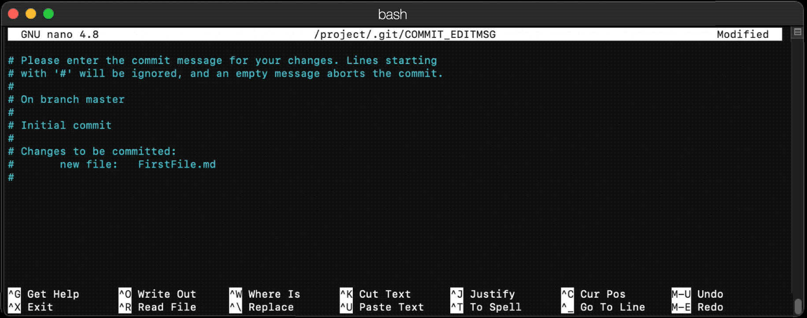
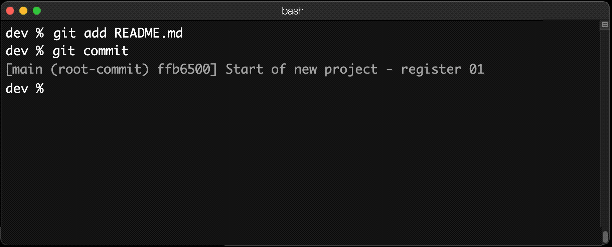
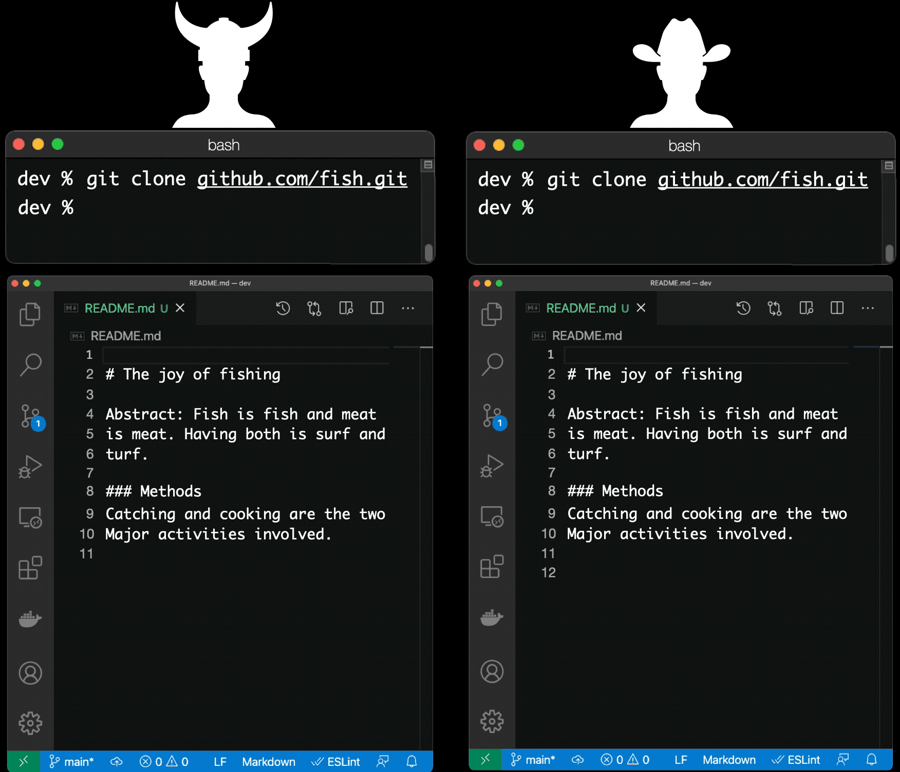
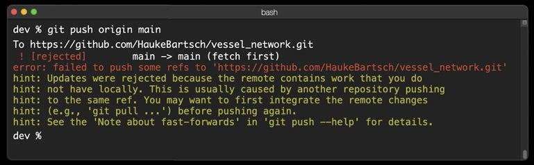
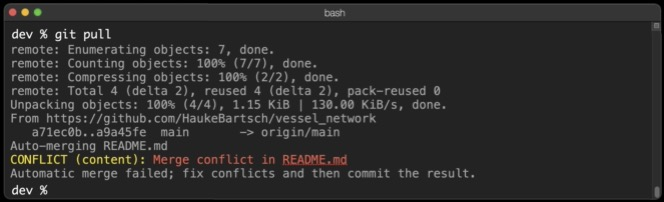

# social-coding


This course is part of a presentation series "Without Any Gaps" at the Mohn Medical Imaging and Visualization Center that provides introductory presentations covering research project management and technological tools to support open science. This presentation was given first as part of the Bergen Biostatistical Seminar (Bbiss) series in April 2021.

## Content creation

A modern text editor focuses on content over form and provides features that make it easy to handle text and text changes.


Text editors are specialized tools that are different from word processors. Many are free or open source. Images on this page are created using the text editor Visual Studio Code.


Text files may share content, or represent the same document changed over time. Each time we can identify lines that are the same or lines that are different.

Here a view of the difference between the first two files


Line numbers are followed by either "+" if a line has been added or by "-" if the line needs to be removed. If we follow these instructions we can convert the first document into the second document - basically here we replace all lines with new content. The tool did realize that the empty line 2 does not have to be changed and can become line 6 in the second document. The *diff* algorithm that computes such matches is an essential tool.


In the second diff 3 lines have changed. Listing the diffs between two version of a document is sometimes also called at *patch* as you can *patch* the problems in the first file by applying all the changes.

## Why should I use version control - and why git?

We need to document the changes in a project. Why some decision have been made and what changed relative to before. That is the major reason to use tools for version control. 


But there are other benefits:
 - social media profile relevant for future employers
 - ability to talk to your future self
 - test a new feature safely and remove all its traces - in case it was not a good idea
 - get a free backup, work from anywhere
 - workflow integration such as Wiki, issue/bug tracking, project home page, continuous integration and security alerts
 - free and open-source software and a large community

Yes, and also to work together with other people on larger projects.

## History of a document and how it maps to git

As today becomes history, what do we want to remember? Here an example where we store our work when:
 - we start
 - we have our first prototype
 - we remember to check for is.na()
 - we forgot to add the library so this will work for other people testing it
 - we document what we did.


<span>&nbsp;</span>

In this example "main" is the name of the branch in the repository that we do work in currently. Its position is linked to the location of the latest change - the *HEAD* of our repository. Adding a memory point, a *commit* will store the status of the file and provide a numeric code for that point, the *commit-id*.

## A commit - the basic unit of git

You *commit* a collection of added or removed lines that belong to a single feature/fix or decision in the project. A commit can be referenced by its *commit-id*, also called its *SHA-1* ('SCHAH-ONE'). The commit is special in git its created
 - based on the author information
 - date of the commit
 - all text in the repository when the commit is created
 - and a log-message

It is important to provide a good log-message as this will be the only way for your future self (or other people) to find out what the intent of your changes was. A good git log message has the following format:
```
Add filter for na

It is necessary to filter out rows with na before creating table 1.
```
In the above example a title line with less than 50 characters is followed by an empty line followed by a description with less than 72 characters. A good idea is to apply the Washington Post test to this message - would you be embarrassed if that message shows up printed in the newspaper? If you are you should probably change it.

This way in which the commit-id is created makes it unique in a project. Comparing two commit-id's is sufficient to decide if two folders show the same information. This is one of the reasons that git is so much faster compared to other version control systems and therefore suitable for large projects.



A usual process in a project is to commit some changes which informs a code reviewer-person. If everything is ok the process ends, but if there is a problem with the latest change the reviewer will file an *issue*. The owner can respond to the issue by changing the code which creates a new commit. This process is repeated during the life-cycle of the project.

## Branches

Git development is mainly done in the default branch called *main*. In some cases it might make sense to create a temporary second branch. All future commits after you *checkout* such a branch would be assigned to that branch. At a later point you can decide to *checkout* the *main* branch again or to *merge* the changes in the second branch back into the *main* branch. A branch is created using the *checkout -b* command.

## Terminology

 - *repo* - A repository is a (hidden) directory called .git/ with all the files related to your work and their history
 - *main* - The position of the *HEAD* of your repository branch named main. This position reflects a specific commit relative to the last. In git you can specificy *HEAD~2* to mean *the commit two commits back from the current HEAD*. This way you move around in your commit history.
 - *commit-id* - A commit-id or SHA-1 is created from the tex, the date, the author committing, the log message, and the previous commit-id.
 - GitHUB - A company that provides a hosting service for git repositories. Other providers are GitLab, Bitbucket and SourceForge.
 - *clone* - Cloning a repository is a process that creates a copy of all the files of a repo on your disc.
 - *branch* - A branch is a different version of your repository usually for a different purpose such as a development branch, or a feature branch. There is always one default branch called *main*.

## Examples for git operations

You can interface with the git software on the command line. All git commands are structured as
```
git <command> [options...]
```

As for all data from a shared repository with ```git clone <address>```.



Create a new repository in a directory "project" with *git init*



Behind the scenes a *git init* will create a new directory called ```.git/```. There are no other changes to your computer. If you remove the directory again you have un-done git init. The folder name has a preceding dot-character. Most operating systems interpret this as a _hidden_ folder. You might not be able to list it but you can enter it to inspect its content if you are curious.



Of some interest is the content of the _config_ file. It stores options of git as well as links to other repositories like the repository home in the cloud (*remote*). Here an example of the content of _config_ for a local repository:
```
[core]
	repositoryformatversion = 0
	filemode = true
	bare = false
	logallrefupdates = true
	ignorecase = true
	precomposeunicode = true
```

## The very first commit

In order to commit changes you first add the files. Afterwards to *commit*. In the next iteration of your code changes you *add* again and *commit* again. These two operations repeat throughout development.



The very first time you try to commit the software will ask you who you are because git commits contain the author information. This includes the name and the email of the author. Provide that information as:
```
git config --global user.name "Hauke Bartsch"
git config --global user.email "HB@gm.com"
```

After specifying the author information your commit will ask you for the commit message



The commit is now stored locally in the .git/ directory. You can verify this by using printing the *git log*.



## Project development in a team

It is easy to collaborate with git. All project partners *clone* their own copy of the shared repository when they start working. As all development (git add, git commit) is local there are no changes to the workflow above. At some point each project partner can decide to *push* his/her commits to the shared repository.

Here an example. We have two users "Alice" and "Bob". Both have cloned the same repository that is shared on github.com. As this is a ficticious example you need to replace the repository address with your own repository.

Both Alice and Bob change the same README.md file, "git add" the file and "git commit" their changes.



All information is still local on the computers of Alice and Bob. If both of them decide to share their work they call:
```
git push origin main
```

In the above command *origin* references a section in the .git/config file that is created when a repository is cloned from a remote source:
```
[remote "origin"]
        url = https://github.com/HaukeBartsch/vessel_network.git
        fetch = +refs/heads/*:refs/remotes/origin/*
```
*main* is of course the name of the branch that Alice and Bob want to synchronize with github.

The above workflow will work for the first person that runs "git push origin main" and update the history of the project on the shared repository. For the second person - lets say Alice there will be an error message asking Alice to first *pull* from the shared repository before being able to *push* her changes.



This ensures that the changes of Alice will be *merged* with the already existing changes of Bob. Therefore there are two operations that are performed on Alice's computer on a *git pull*. The first is a *git fetch* that updates the information in Alices .git/ directory and a *git merge* that merges her locally commited changes with the new commits from Bob.

After a final *git push origin master* also Alices changes will be visible in the shared repository.

## What can go wrong?

If both Alice and Bob edit different documents or different lines of the same document there is no problem and git will handle all the merge operations automatically. The efficiency with which git is handling this part is the major reason that git is used everywhere instead of other version control software.

If Alice and Bob edit the same line in a document the merge attempt of git will end with a *merge conflict*. If Bob was first submitting his changes the merge conflict will only happen on Alices computer. Her changes would have to be integrated with Bob's. Let say both change the title line in the README.md. git cannot know who should have the final say. Alice is asked in this case to manually merge.



Git will add the information from Bob to the document that caused the merge conflict (README.md). It will list his changes and Alices changes using some special lines with enclosed in "<<<..." and ">>>>...". Alice is resolving the conflict by reviewing each section and deciding which of the two options should be selected. Alice can not just select one of the options but can _merge_ them together (team player). Once all the merge conflice section in the document are resolved (no more "<<< ... >>>") Alice can finish the merge resolve with:
```
git add README.md
git commit
git push
```

